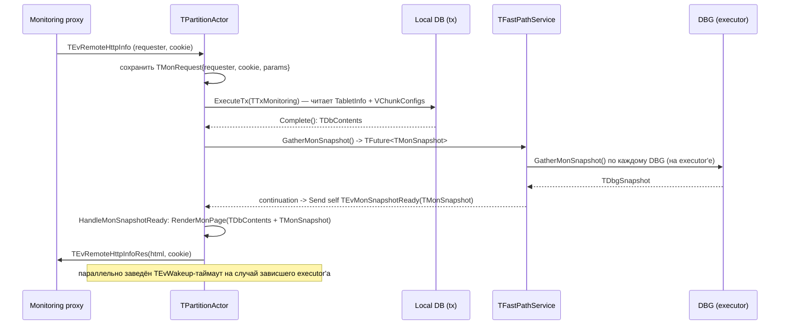

# Дизайн: Tablet UI для partition_direct (read-only, v1)

- **Дата:** 2026-06-22
- **Репозиторий/ветка:** `ydb_partition_ui` / `partition_direct_tablet_ui` (база — `add_host_dbg` @ `3be694ff623`)
- **Статус:** утверждён, готов к составлению плана реализации

## 1. Контекст и цель

Таблетка `TPartitionActor`
(`ydb/core/nbs/cloud/blockstore/libs/storage/partition_direct/`) сейчас **не имеет
HTTP-страницы мониторинга** — это первая mon-страница таблетки в nbs-дереве
(`NMon::TEvRemoteHttpInfo` молча уходит в `HandleDefaultEvents`).

Цель: дать оператору read-only страницу, на которой видно:

- что записано в локальную БД таблетки (`TabletInfo`, `VChunkConfigs`);
- какие барьеры стоят (per-vchunk safe-barrier для erase, общий собранный барьер,
  значение LSN-генератора, last barrier-erase LSN);
- статистику и рантайм-состояние: DBG-топология и коннекты, состояния хостов и
  здоровье из Oracle, инфлайты/ошибки по операциям, счётчики dirty map, состояние
  DDisk и PBuffer по хостам, конфиги vchunk'ов.

Референсы стиля (тот же кодовый идиом, макросы `HTML()/TABLE()/...` из
`library/cpp/monlib/service/pages/templates.h`):
- `ydb/core/blobstorage/ddisk/persistent_buffer_mon.cpp` (богатый вариант — панель
  настроек, авторефреш, AJAX, таблицы латентности, SVG);
- `ydb/core/blobstorage/ddisk/ddisk_actor_mon.cpp` (простой вариант — секции-таблицы,
  `setTimeout`-рефреш);
- partition/volume из открытого nbs 1.0 (`ydb-platform/nbs`,
  `cloud/blockstore/.../partition/part_actor_monitoring*.cpp`) — привычные разделы и
  вкладки.

## 2. Не-цели (v1)

- **Никаких мутаций.** Только просмотр. Кнопки-действия (AddHost, force flush/erase,
  принудительный сбор барьера, дамп), POST-хендлеры — отдельная фаза 2.
- Без AJAX-обновления контента, чекбоксов-фильтров, SVG-визуализаций и перцентилей
  латентности (фаза 2). Авторефреш — простой `setTimeout` перезагрузкой страницы.

Решения приняты пользователем в брейнсторминге: read-only сейчас, действия потом;
средняя насыщенность; полностью структурный источник данных (а не текстовые дампы).

## 3. Точка подключения и состав

- В `STFUNC(TPartitionActor::StateWork)` добавить
  `HFunc(NMon::TEvRemoteHttpInfo, HandleHttpInfo)` (до ветки `default`).
- Новые файлы (конвенция `part_*` + подпапка `monitoring/`):
  - `part_monitoring.cpp` — `TPartitionActor::HandleHttpInfo`, read-only
    транзакция `TTxMonitoring`, обработчик `TEvMonSnapshotReady` и таймаут
    `TEvWakeup`, склейка БД-снапшота и рантайм-снапшота, отправка ответа.
  - `monitoring/mon_snapshot.h` — plain-структуры снапшота (без зависимостей от
    actor'а и от тяжёлых классов; только POD/контейнеры и enum'ы из `model/`).
  - `monitoring/mon_render.h` / `monitoring/mon_render.cpp` — **чистая** функция
    `RenderMonPage(const TMonPageData&) -> TString` (тестируется без actor'а).
- Правки существующих файлов (добавление структурных снапшот-аксессоров рядом с
  имеющимися `DebugPrint*()`):
  - `partition_direct_actor.h` / `.cpp`, `partition_direct_events_private.h`
    (новые приватные эвенты),
  - `fast_path_service.h` / `.cpp` (агрегатор `GatherMonSnapshot()`),
  - `direct_block_group.h`, `direct_block_group_impl.h` / `.cpp`
    (`GatherMonSnapshot() -> TFuture<TDbgSnapshot>`),
  - `vchunk.h` / `.cpp` (`BuildSnapshot() -> TVChunkSnapshot`),
  - `dirty_map/dirty_map.h` / `.cpp` (счётчики/состояния → структуры),
  - `model/oracle.h` / `.cpp`, `model/host_stat.h`, `model/host_state.h`
    (снапшот здоровья/статы хостов).
  - `ya.make` — новые исходники; `ut/ya.make` (или `partition_direct_ut`) — новые тесты.

## 4. Поток данных

Страница соединяет два асинхронных источника, и всё делается внутри
`TPartitionActor` (отдельный actor не нужен: tablet-транзакцию умеет крутить только
сама таблетка). Шаги:



Последовательность (сначала транзакция БД, затем рантайм-снапшот) выбрана ради
простоты: не нужно «джойнить» два независимых future по cookie. `TMonRequest`
хранится в `THashMap<ui64 /*cookie*/, TMonRequest>` в actor'е; cookie выдаём
монотонным счётчиком и кладём в продолжение future.

## 5. Структурный снапшот

Plain-структуры в `monitoring/mon_snapshot.h` (заполняются на executor'е,
копируются в actor):

```
struct TMonSnapshot {
    ui64 LsnCounter;                       // FastPathService::SequenceGenerator
    std::optional<ui64> GlobalSafeBarrier; // последний собранный безопасный барьер
    std::optional<ui64> LastBarrierEraseLsn;
    TVolumeCountersSnapshot Counters;      // ключевые поля TVolumeCounters
    TVector<TDbgSnapshot> Dbgs;
};

struct TDbgSnapshot {
    size_t Index;
    TVector<TConnSnapshot> Connections;    // ddisk/pbuffer id, session-state, lock/quorum
    TVector<THostSnapshot> Hosts;          // на уровне DBG
    TVector<TVChunkSnapshot> VChunks;
};

struct THostSnapshot {
    THostIndex Index;
    EHostState State;                      // Online/TemporaryOffline/Offline
    EHostHealth Health;                    // Online/Sufferer/TemporaryOffline/Offline
    std::array<size_t, EOperation::Count_> InflightByOp;
    TErrorsInfo Errors;                    // count + время с первой/последней ошибки
    ui64 PBufferUsedSize;
};

struct TVChunkSnapshot {
    ui32 Index;
    TVChunkConfigView Config;              // роли PBuffer/DDisk, EnabledHosts, Watermarks
    TDirtyMapCounts Counts;                // inflight/clone/flush/erase/belated + min/max LSN
    std::optional<ui64> SafeBarrier;       // GetSafeBarrierForErase()
    TVector<TDDiskStateView> DDiskStates;  // per-host: EState, block-counts, watermarks
    TVector<TPBufferCountersView> PBuffers; // per-host: records/bytes, locked
};
```

Сбор:
- `IDirectBlockGroup::GatherMonSnapshot() -> TFuture<TDbgSnapshot>` — реализация в
  `TDirectBlockGroup` исполняется на executor'е (через `Executor`/`Schedule`, как
  существующий `Dump()`), снимает `Oracle`, коннекты, и по каждому живому vchunk'у
  зовёт `TVChunk::BuildSnapshot()`.
- `TVChunk::BuildSnapshot()` — синхронно на executor'е читает `TVChunkConfig`,
  `TBlocksDirtyMap` (новые методы-снапшоты рядом с `DebugPrint*`), safe-barrier.
- `TFastPathService::GatherMonSnapshot()` — агрегирует фьючи всех DBG (тот же
  паттерн `DumpLock`/`DumpCount`/`DebugDumps`, что у существующего dump-сбора),
  добавляет глобальные поля (LSN-генератор, барьеры, `TVolumeCounters`).

В `dirty_map`/`vchunk`/`oracle`/`host_stat`/`host_state` добавляем `…Snapshot()`/
`BuildSnapshot()` методы, возвращающие структуры из `mon_snapshot.h`, рядом с уже
существующими `DebugPrint*()` (их не трогаем).

Вход рендера — агрегат (тоже в `mon_snapshot.h`), чтобы `RenderMonPage` оставался
чистой функцией:

```
struct TMonPageData {
    THeaderInfo Header;                  // tabletId, generation, diskId, uptime, state
    TDbContents Db;                      // строки TabletInfo + VChunkConfigs из TTxMonitoring
    std::optional<TMonSnapshot> Runtime; // отсутствует в BOOT/INIT или при ошибке сбора
    std::optional<TString> RuntimeError; // текст баннера, если рантайм недоступен
    TCgiFilters Filters;                 // ?dbg=N / ?vchunk=N
};
```

## 6. Разделы страницы (medium; секции-таблицы + `setTimeout`-авторефреш)

1. **Header** — tabletId, generation, diskId, uptime, state (BOOT/INIT/WORK/ZOMBIE).
2. **Overview** — сводка `VolumeConfig` (blockSize, blocksCount), #DBG, #vchunk,
   глобальный LSN-счётчик, глобальный safe-barrier, ключевые `TVolumeCounters`.
3. **Local DB** — строка `TabletInfo` (сводка `StorageConfig`, `VolumeConfig`,
   `DirectBlockGroupsConnections`) + таблица `VChunkConfigs` (персистнутые оверрайды).
4. **Direct Block Groups** — по DBG: коннекты (ddisk/pbuffer id), session/lock-состояния,
   кворум.
5. **Hosts** — по DBG×host: `EHostState`, oracle-health, инфлайты по операциям, ошибки
   (count, время с первой/последней), pbuffer used size.
6. **VChunks** — по vchunk: конфиг (роли/enabled/watermarks), счётчики dirty map,
   safe-barrier, ddisk-state по хостам, pbuffer-counters по хостам.
7. **Barriers** — per-vchunk safe-barrier + глобальный собранный + last barrier-erase
   LSN + LSN-генератор.

Лёгкие query-фильтры `?dbg=N` / `?vchunk=N` для больших секций (без AJAX — это
фаза 2). Авторефреш — `<script>setTimeout(...)`. Все динамические строки экранируем
(`htmlEscape`).

## 7. Обработка ошибок и краевые случаи

- Таблетка в `STATE_BOOT`/`STATE_INIT` (нет `FastPathService`) → минимальная страница
  «таблетка инициализируется» + то, что есть из локальной БД; рантайм-секции
  помечаем «недоступно».
- Future снапшота упал/таймаут (`TEvWakeup`) → рендерим страницу с данными БД +
  баннер ошибки в рантайм-секциях; запрос не подвешиваем.
- Невалидные/пустые query-параметры → игнорируем фильтр (показываем всё).
- Экранирование HTML обязательно для всех значений из БД/рантайма.

## 8. Тестирование

- **Юнит, без actor'а:** `RenderMonPage(TMonPageData)` — на собранных вручную
  структурах проверяем, что HTML содержит ожидаемые секции/значения и хорошо
  сформирован; проверяем экранирование. Снапшот-билдеры (`BuildSnapshot()`,
  `dirty_map` `…Snapshot()`) — на подготовленном состоянии сверяем поля.
- **Интеграционный** в `partition_direct_ut`: послать таблетке
  `NMon::TEvRemoteHttpInfo`, дождаться `TEvRemoteHttpInfoRes`, проверить наличие
  ожидаемых разделов и отсутствие падений в boot/work состояниях.
- Сборка/тесты: на cloud в `~/ydb_partition_ui`
  `./ya make --build relwithdebinfo -tA <folder> -F *MonTest* 2>&1 | tail`.

## 9. Инфраструктура

- Изолированный репозиторий (Mac + cloud) на ветке `partition_direct_tablet_ui`,
  Mutagen-сессия `ydb-partition-ui` (`--ignore-vcs`). Существующий `ydb_bg` не трогаем.
- Правки — на Mac (синк автоматический), сборка/тесты — на cloud в `~/ydb_partition_ui`.
  Перед доверием зелёной сборке — `mutagen sync flush ydb-partition-ui` и проверка,
  что cloud-копия содержит свежие правки (см. memory `remote-build-verify-edit-path`).
- Git-операции — на Mac, в новом репозитории. Без `Co-Authored-By: Claude`.

## 10. Фаза 2 (вне объёма v1)

Кнопки-действия (AddHost, force flush/erase, сбор барьера, дамп), AJAX-обновление
контента, чекбоксы-фильтры и панель настроек, SVG-карты свободного места,
перцентили латентности по операциям.
