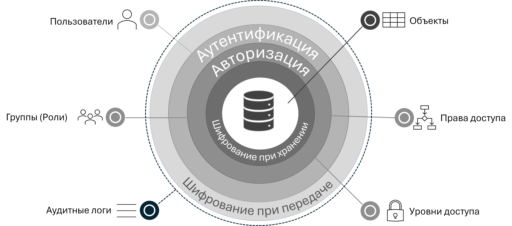

# {{ ydb-short-name }} для инженеров по безопасности

В этом разделе документации {{ ydb-short-name }} рассматриваются аспекты работы с {{ ydb-short-name }}, связанные с безопасностью. Также он будет полезен для целей обеспечения compliance.

- **[Аутентификация](./authentication.md) и [авторизация](./authorization.md)**. Система управления доступом в {{ ydb-short-name }} предоставляет механизм защиты данных в кластере {{ ydb-short-name }}. Благодаря системе доступов только авторизованные [субъекты доступа](../concepts/glossary.md#access-subject) (пользователи и группы) могут работать с данными, а доступ к данным может ограничиваться.

    При доступе к базе данных {{ ydb-short-name }} [пользователи](../concepts/glossary.md#access-user) проходят [аутентификацию](./authentication.md) — процесс проверки пользователя, который подтверждает его личность при доступе к базе данных. На основе аутентификационных данных пользователь затем проходит [авторизацию](./authorization.md) — процесс предоставления определённых [прав доступа](../concepts/glossary.md#access-right) и [уровней доступа](../concepts/glossary.md#access-level) пользователю на использование объектов базы данных {{ ydb-short-name }}.

    {{ ydb-short-name }} позволяет работать как с внутренними [пользователями](./authorization.md#user) так и с пользователями из разных каталогов и систем. После проведения [аутентификации](./authentication.md), пользователи идентифицируются в кластере {{ ydb-short-name }} с помощью [SID](./authorization.md#sid). SID — это строка, которая содержит имя пользователя и его источник (auth domain).

    [Права доступа](./authorization.md#right) в {{ ydb-short-name }} привязываются к [объекту доступа](../concepts/glossary.md#access-object) с помощью [списков прав](../concepts/glossary.md#access-control-list). Формат списков прав описан в статье [{#T}](./short-access-control-notation.md).

    Для управления дополнительными возможностями [субъекта доступа](#access-subject) в контекстах, не связанных с [объектами схемы](#scheme-object), используется [списки разрешений](../concepts/glossary.md#access-level).

    По умолчанию при первом запуске кластера {{ ydb-short-name }} выполняется [встроенная настройка безопасности](./builtin-security.md), которая добавляет в систему [суперпользователя](./builtin-security.md#superuser), а также реализует набор [ролей](./builtin-security.md#role) безопасности для удобного управления пользователями.

- **Шифрование**. Так как YDB является распределённой системой, обычно работающей на кластере, часто расположенным в нескольких датацентрах или зонах доступности, пользовательские данные регулярно передаются по сети. Могут использоваться различные протоколы, каждый из которых может быть настроен для работы с использованием [шифрования данных при передаче](./encryption/data-in-transit.md). YDB также поддерживает прозрачное [шифрование данных при хранении](./encryption/data-at-rest.md) на уровне прокси распределённого хранилища.

- **Аудитные логи**. {{ ydb-short-name }} предоставляет в [аудитных логах](./audit-log.md) данные о всех операциях (успешных или не успешных) над объектами YDB.

Основные материалы:

- [{#T}](authentication.md)
- [{#T}](authorization.md)
- [{#T}](builtin-security.md)
- [{#T}](audit-log.md)
- Шифрование:

  - [{#T}](encryption/data-at-rest.md)
  - [{#T}](encryption/data-in-transit.md)

- [{#T}](short-access-control-notation.md)
- Концепции:

  - [{#T}](../concepts/connect.md)
